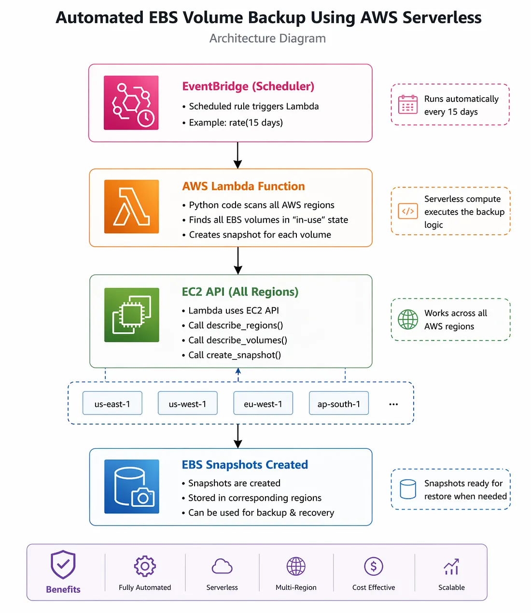

#  Automating EBS Volume Backups Using AWS Serverless (Lambda + EventBridge)

## 📌 Project Overview

Backing up cloud resources is essential for ensuring **data durability, fault tolerance, and disaster recovery**.

In this project, I built a **fully automated serverless EBS backup system** using AWS services like **AWS Lambda, Amazon EventBridge, EC2, EBS, and IAM**.

This solution eliminates manual backup tasks and ensures **scheduled, automated snapshots of all active EBS volumes across AWS regions**, in a cost-effective and scalable way.

## 🎯 Project Goals

- Automate EBS volume backups
- Eliminate manual snapshot creation
- Use a fully serverless architecture
- Schedule backups at fixed intervals
- Ensure secure access using IAM roles

## ☁️ AWS Services Used

### 🔹 Amazon EC2 & EBS
- EC2 provides virtual machines
- EBS provides persistent block storage attached to EC2
- Snapshots are used to back up EBS volumes

### 🔹 AWS Lambda
- Serverless compute service
- Executes backup automation logic
- Automatically scales based on demand

👉 Responsibilities:
- Fetch EBS volumes
- Create snapshots
- Log backup status

### 🔹 AWS IAM (Identity and Access Management)
- Provides secure access control
- Lambda uses IAM role to access AWS resources

Required permissions:
- `ec2:DescribeVolumes`
- `ec2:CreateSnapshot`

---

### 🔹 Amazon EventBridge
- Acts as a scheduler (cron job alternative)
- Triggers Lambda automatically at defined intervals (e.g., every 15 days)

## 🏗️ Architecture Diagram

### 🔄 Workflow
1. EventBridge triggers Lambda on schedule  
2. Lambda scans all AWS regions  
3. Identifies active EBS volumes  
4. Creates snapshots automatically  
5. Stores backups in EC2 Snapshots  

---

## 🧑‍💻 Step-by-Step Implementation

### Step 1: Create Lambda Function
- Go to AWS Lambda Console
- Runtime: Python 3.x
- Function name: `Volume-Backup`

[text](images/labada%20function.webp)

### Step 2: Lambda Code

python
import boto3

def lambda_handler(event, context):

    ec2_client = boto3.client('ec2')
    regions_response = ec2_client.describe_regions()

    regions = [r['RegionName'] for r in regions_response['Regions']]

    snapshots_created = []

    for region in regions:
        ec2 = boto3.client('ec2', region_name=region)

        volumes = ec2.describe_volumes(
            Filters=[{'Name': 'status', 'Values': ['in-use']}]
        )['Volumes']

        for volume in volumes:
            try:
                snapshot = ec2.create_snapshot(
                    VolumeId=volume['VolumeId'],
                    Description=f"Auto backup for {volume['VolumeId']}"
                )

                snapshots_created.append(snapshot['SnapshotId'])

            except Exception as e:
                print("Error:", str(e))

    return {
        "statusCode": 200,
        "body": snapshots_created
    }

 ## Step 3: Create IAM Role
Service: Lambda
Attach policy:
AmazonEC2FullAccess (for testing)

Role name: LambdaEc2FullAccess

## Step 4: Attach IAM Role to Lambda
Go to Lambda → Configuration → Permissions
Attach role: LambdaEc2FullAccess

[text](images/role%20Attach%201.webp)
[text](images/role%20Attach%202.webp)

## Step 5: Test Lambda Function
{
  "key1": "value1"
}

Expected output:

Status code: 200
Snapshot IDs generated

## Step 6: Verify Snapshots

Go to:

EC2 → Snapshots

You will see:

Snapshot ID created
Status: Completed
Progress: 100%

[text](images/verify%20Snapshot.webp)

## Step 7: Automate Using EventBridge
Go to EventBridge → Rules → Create Rule
Type: Scheduled Rule
Name: EBS-Backup-Rule
[text](images/Automate%20Using%20EventBridge.webp)

## Step 8: Schedule Configuration

Example:

rate(15 days)
[text](images/Schedule%20image.webp)

## Step 9: Select Target
Target type: AWS service
Select:
Lambda function
Function: Volume-Backup
Permissions:
Create new role (recommended)

[text](images/target%20image.webp)

## Step 10: Review & Create
Verify configuration
Click Create rule
[text](images/review.webp)

## Final Result
Your system now:
Automatically runs every 15 days
Scans all AWS regions
Creates snapshots of all active EBS volumes

[text](images/verify%20Snapshot.webp)
